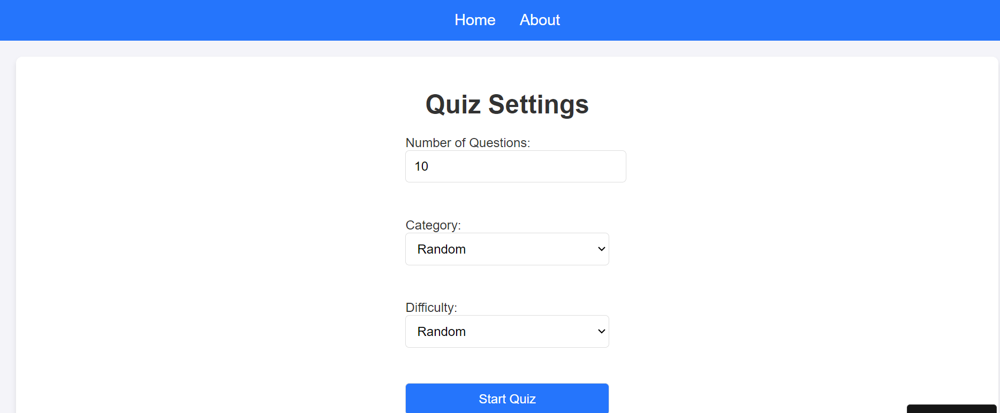
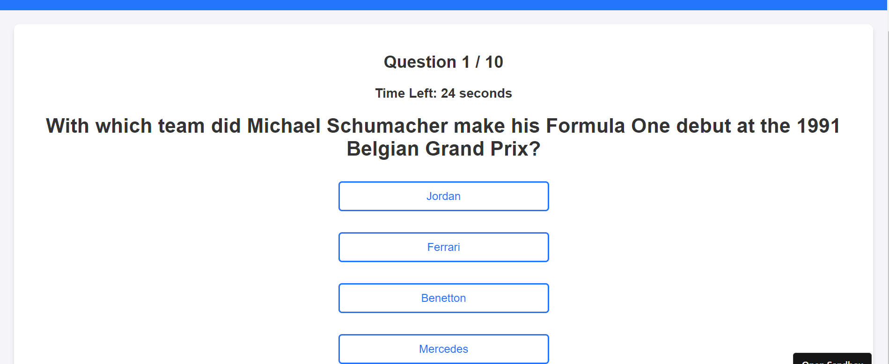
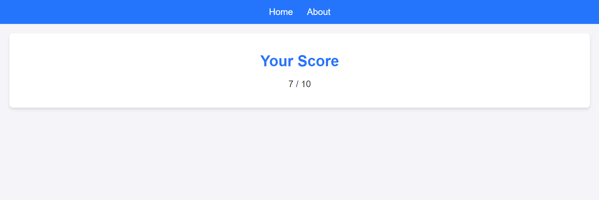

# Project 405 Quiz Trivia

Welcome to the **Project 405 Quiz Trivia**! This is a React-based trivia application where users can answer quiz questions and see their results. The project demonstrates a modular and responsive web application built with React.

---

## Features

- Dynamic quiz questions with multiple-choice answers.
- Categories and Customization
- Scoring system that calculates and displays results.
- Responsive design for mobile and desktop devices.

---

## Getting Started

You can access the app directly via the following link:

👉 [Trivia Quiz](https://qs3r4c.csb.app/home)

Simply click the link and start enjoying the quiz!

## Screenshots 

### Home Page

### Settings

### Quiz in Progress

### Results Page

